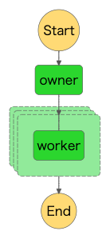

# Parallel Distributed Processing in AWS
AWSサービスにおける並列分散バッチ処理の検証

## 検証
### 内容
下記の4つの実行環境において 
`usersテーブル`上の各ユーザーに対して`num`数分のTweetデータを作成し、 
そのTweetデータを`tweetsテーブル`に格納する。までの実行時間の計測を行う。

#### # 実行環境
1. Lambda
2. Step Functions（Lambda）
3. Step Functions（ECS）
4. AWS Batch（Fargate）

#### # usersテーブル
|  id  |  name  |  num  |
| ---- | ---- | ---- |
|  1  |  akio  |  50  |
|  2  |  miki  |  50  |

#### # tweetsテーブル
|  twid  |  tw_user_id  | text |  created_at  |
| ---- | ---- | ---- | ---- |
|  27463  |  1  |  ほにゃらら  |  2022-06-30 12:57:25  |
|  59349  |  2  |  hogehoge  |  2022-06-30 12:57:25  |

### 検証状況
* users：500
* num：50（一律で設定）

## 1. Lambda
### ◇ 構成
### ◇ 検証
#### # 検証結果 

## 2. Step Functions（Lambda）
### ◇ 構成

### ◇ 検証
#### # 検証結果
* 実行時間：18.4s
* tweets：25,000
#### # 考察
単体のworkerだと1sほどで完了するため実行に時間がかかっている。 
⇒ 各workerの起動時刻にラグがある 
⇒ タスクの受け渡しやLambdaの起動にオーバーヘッドがある

とはいえ単一で実行する時と比べて圧倒的に速い

## 3. Step Functions（ECS）
上記の `Step Functions（Lambda）` においてECSに変更するだけのため作成は割愛

## 4. AWS Batch（Fargate）
### ◇ 構成

### ◇ 実行時間
